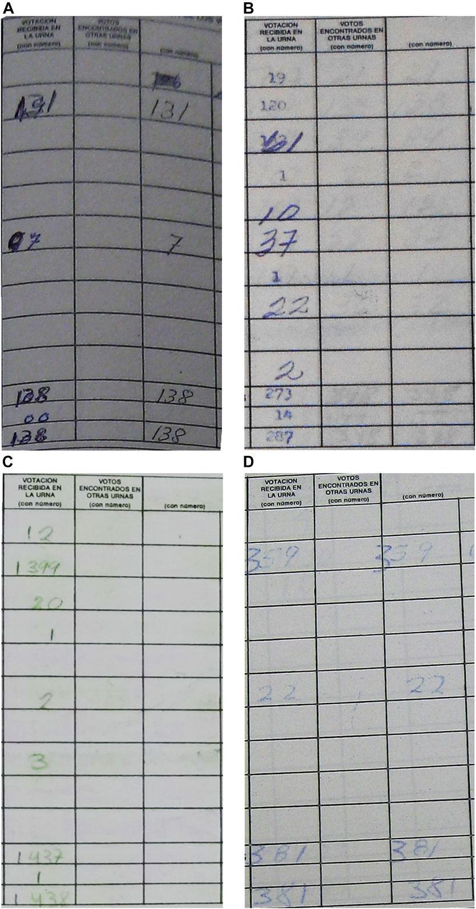

```{r setup, include=FALSE}
knitr::opts_chunk$set(echo = TRUE, message = FALSE, echo = FALSE, warning = FALSE)
```

## General Introduction

In this Problem Set, you will apply data science skills to wrangle and visualize the replication data of the following research article:

Cantú, F. (2019). The fingerprints of fraud: Evidence from Mexico's 1988 presidential election. *American Political Science Review*, *113*(3), 710-726.

## Requirements and Reminders

-   You are required to use **RMarkdown** to compile your answer to this Problem Set.

-   Two submissions are required (via Moodle)

    -   A `.pdf` file rendered by `Rmarkdown` that contains all your answer.

    -   A compressed (in `.zip` format) R project repo. The expectation is that the instructor can unzip, open the project file, knitr your `.Rmd` file, and obtain the exact same output as the submitted `.pdf` document.

-   The Problem Set is worth 30 points in total, allocated across 7 tasks. The point distribution across tasks is specified in the title line of each task. Within each task, the points are evenly distributed across sub-tasks. Bonus points (+5% max.) will be awarded to recognize exceptional performance.

-   Grading rubrics: Overall, your answer will be evaluated based on its quality in three dimensions

    -   Correctness and beauty of your outputs

    -   Style of your code

    -   Insightfulness of your interpretation or discussion

-   Unless otherwise specified, you are required to use functions from the `tidyverse` package to complete this assignments.

-   Fo some tasks, they may be multiple ways to achieve the same desired outcomes. You are encouraged to explore multiple methods. If you perform a task using multiple methods, do show it in your submission. You may earn bonus points for it.

-   You are encouraged to use Generative AI such as ChatGPT to assist with your work. However, you will need to acknowledge it properly and validate AI's outputs. You may attach selected chat history with the AI you use and describe how it helps you get the work done. Extra credit may be rewarded to recognize creative use of Generative AI.

-   This Problem Set is an individual assignment. You are expected to complete it independently. Clarification questions are welcome. Discussions on concepts and techniques related to the Problem Set among peers is encouraged. However, without the instructor's consent, sharing (sending and requesting) code and text that complete the entirety of a task is prohibited. You are strongly encouraged to use *CampusWire* for clarification questions and discussions.

\clearpage

## Background

In 1998, Mexico had a close presidential election. Irregularities were detected around the country during the voting process. For example, when 2% of the vote tallies had been counted, the preliminary results showed the PRI's imminent defeat in Mexico City metropolitan area and a very narrow vote margin between PRI and FDN. A few minutes later, the screens at the Ministry of Interior went blank, an event that electoral authorities justified as a technical problem caused by an overload on telephone lines. The vote count was therefore suspended for three days, despite the fact that opposition representatives found a computer in the basement that continued to receive electoral results. Three days later, the vote count resumed, and soon the official announced PRI's winning with 50.4% of the vote.

*What happened on that night and the following days? Were there electoral fraud during the election?* A political scientist, Francisco Cantú, unearths a promising dataset that could provide some clues. At the National Archive in Mexico City, Cantú discovered about 53,000 vote tally sheets. Using machine learning methods, he detected that a significant number of tally sheets were *altered*! In addition, he found evidence that the altered tally sheets were biased in favor of the incumbent party. In this Problem Set, you will use Cantú's replication dossier to replicate and extend his data work.

Please read Cantú (2019) for the full story. And see Figure 1 for a few examples of altered (fraudulent) tallies.

{width="260"}

\clearpage

## Task 0. Loading required packages (3pt)

For Better organization, it is a good habit to load all required packages up front at the start of your document. Please load the all packages you use throughout the whole Problem Set here.

```{r, echo=TRUE}
library(tidyverse)
library(sf)
```

\clearpage

## Task 1. Clean machine classification results (3pt)

Cantú applys machine learning models to 55,334 images of tally sheets to detect signs of fraud (i.e., alteration). The machine learning model returns results recorded in a table. The information in this table is messy and requires data wrangling before we can use them.

### Task 1.1. Load classified images of tally sheets

The path of the classified images of tally sheets is `data/classification.txt`. Your first task is loading these data onto R using a `tidyverse` function. Name it `d_tally`.

Note:

-   Although the file extension of this dataset is `.txt`, you are recommended to use the `tidyverse` function we use for `.csv` files to read it.

-   Unlike the data files we have read in class, this table has *no column names*. Look up the documentation and find a way to handle it.

-   There will be three columns in this dataset, name them `name_image`, `label`, and `probability`.

Print your table to show your output.

```{r echo=TRUE}
d_tally <- read_csv("data/classification.txt", col_names = FALSE)
colnames(d_tally) <- c("name_image", "label", "probability")
print(d_tally)
```

\clearpage

### Note 1. What are in this dataset?

Before you proceed, let me explain the meaning of the three variables.

-   `name_image` contains the names of of the tallies' image files (as you may infer from the `.jpg` file extensions. They contain information about the locations where each of the tally sheets are produced.

-   `label` is a machine-predicted label indicating whether a tally is fraudulent or not. `label = 1` means the machine learning model has detected signs of fraud in the tally sheet. `label = 0` means the machine detects no sign of fraud in the tally sheet. In short, `label = 1` means fraud; `label = 0` means no fraud.

-   `probability` indicates the machine's certainty about its predicted `label` (explained above). It ranges from 0 to 1, where higher values mean higher level of certainty.

Interpret `label` and `probability` carefully. Two examples can hopefully give you clues about their correct interpretation. In the first row, `label = 0` and `probability = 0.9991`. That means the machine thinks this tally sheet is NOT FRAUDULENT with a probability of 0.9991. Then, the probability that this tally sheet is fraudulent is `1 - 0.9991 = 0.0009`. Take another example, in the 11th row, `label = 1` and `probability = 0.935`. This means the machine thinks this tally sheet IS FRAUDULENT with a probability of 0.935. Then, the probability that it is NOT FRAUDULENT is `1 - 0.9354 = 0.0646`.

\clearpage

### Task 1.2. Clean columns `label` and `probability`

As you have seen in the printed outputs, columns `label` and `probability` are read as `chr` variables when they are actually numbers. A close look at the data may tell you why --- they are "wrapped" by some non-numeric characters. In this task, you will clean these two variables and make them valid numeric variables. You are required to use `tidyverse` operations to for this task. Show appropriate summary statistics of `label` and `probability` respectively after you have transformed them into numeric variables.

```{r, echo=TRUE}
d_tally$label <- d_tally$label |>
  str_remove_all("\\[|\\]") |>
  as.numeric()
d_tally$probability <- d_tally$probability |>
  str_remove_all("\\[|\\]") |>
  as.numeric()
d_tally
summary(d_tally$label)
summary(d_tally$probability)
```

\clearpage

### Task 1.3. Extract state and district information from `name_image`

As explained in the note, the column `name_image`, which has the names of tally sheets' images, contains information about locations where the tally sheets are produced. Specifically, the first two elements of these file names indicates the **states'** and districts' identifiers respectively, for example, `name_image = "Aguascalientes_I_2014-05-26 00.00.10.jpg"`. It means this tally sheet is produced in state **`Aguascalientes`**, district **`I`**. In this task, you are required to obtain this information. Specifically, create two columns named `state` and `district` as state and district identifiers respectively. You are required to use `tidyverse` functions to perform the task.

```{r, echo=TRUE}
d_tally <- d_tally |> separate(name_image, into = c("state", "district"), 
                               sep = "_", remove = FALSE)
d_tally
```

\clearpage

### Task 1.4. Re-code a state's name

One of the states (in the newly created column `state`) is coded as "`Estado de Mexico`." The researchers decide that it should instead re-coded as "**`Edomex`**." Please use a `tidyverse` function to perform this task.

Hint: Look up functions `ifelse` and `case_match`.

```{r, echo=TRUE}
d_tally <- d_tally |> mutate(state = ifelse(state == "Estado de Mexico", "Edomex", state))
edomex <- d_tally |> filter(state == "Edomex")
edomex
```

\clearpage

### Task 1.5. Create a *probability of fraud* indicator

As explained in Note 1, we need to interpret `label` and `probability` with caution, as the meaning of `probability` is conditional on the value of `label`. To avoid confusion in the analysis, your next task is to create a column named `fraud_proba` which indicates the probability that a tally sheet is is fraudulent. After you have created the column, drop the `label` and `probability` columns.

*Hint: Look up the `ifelse` function and the `case_when` function (but you just need either one of them).*

```{r, echo=TRUE}
d_tally <- d_tally |> 
  mutate(fraud_proba = ifelse(label == 1, probability, 1 - probability)) |>
  select(-label, -probability)
d_tally
```

\clearpage

### Task 1.6. Create a binary *fraud* indicator

In this task, you will create a binary indicator called `fraud_bin` in indicating whether a tally sheet is fraudulent. Following the researcher's rule, we consider a tally sheet fraudulent only when the machine thinks it is at least 2/3 likely to be fraudulent. That is, `fraud_bin` is set to TRUE when `fraud_proba` is greater to `2/3` and is FALSE otherwise.

```{r, echo=TRUE}
d_tally <- d_tally |>
  mutate(fraud_bin = ifelse(fraud_proba > 2/3, TRUE, FALSE))
d_tally
```

\clearpage

## Task 2. Visualize machine classification results (3pt)

In this section, you will visualize the `tally` dataset that you have cleaned in Task 1. Unless otherwise specified, you are required to use the `ggplot` packages to perform all the tasks.

### Task 2.1. Visualize distribution of `fraud_proba`

How is the predicted probability of fraud (`fraud_proba`) distributed? Use two methods to visualize the distribution. Remember to add informative labels to the figure. Describe the plot with a few sentences.

```{r, echo=TRUE, fig.width=5, fig.height=4, out.width="50%", fig.align='center'}
ggplot(d_tally, aes(x = fraud_proba)) +
  geom_histogram(binwidth = 0.05, fill = "darkgray", color = "black") +
  labs(title = "Predicted Fraud Probability: Histogram",
       x = "Fraud Probability",
       y = "Count")
```

The "Histogram of Predicted Fraud Probability" exhibits a U-shaped distribution with concentrations of values at two distinct areas - P(fraud) = 0 (low probability of fraud) and P(fraud) = 1 (high probability of fraud). Compared to the "P(fraud) = 1" bin, the "P(fraud) = 0" bin is higher, indicating a higher frequency of P(fraud) = 0 predictions.

```{r, echo=TRUE}
ggplot(d_tally, aes(x = fraud_proba)) +
  geom_density(fill = "darkgray") +
  labs(title = "Predicted Fraud Probability: Density Plot",
       x = "Fraud Probability",
       y = "Density")
```

The "Density Plot of Predicted Fraud Probability" exhibits a similar U-shaped distribution with "Histogram of Predicted Fraud Probability". It also has a concentration of values at two distinct areas - P(fraud) = 0 (low probability of fraud) and P(fraud) = 1 (high probability of fraud). In comparison, the "P(fraud) = 0" peak is higher than the "P(fraud) = 1" peak, indicating higher frequency in P(fraud) = 0 predictions.

\clearpage

### Task 2.2. Visualize distribution of `fraud_bin`

How many tally sheets are fraudulent and how many are not? We may answer this question by visualizing the binary indicator of tally-level states of fraud. Use at least two methods to visualize the distribution of `fraud_bin`. Remember to add informative labels to the figure. Describe your plots with a few sentences.

```{r, echo=TRUE, fig.width=5, fig.height=4, out.width="50%", fig.align='center'}
ggplot(d_tally, aes(x = fraud_bin)) +
  geom_bar(fill = "skyblue", color = "black") +
  labs(title = "Fraudulent Tally Sheets: Bar Chart",
       x = "Fraudulent Tally Sheets",
       y = "Count")
```

Based on the "Fraudulent Tally Sheets: Bar Chart", the 'FALSE' bar is nearly twice the size of the 'TRUE' bar. According to the researcher's rule, this suggests that a substantial majority of the tally sheets are not deemed fraudulent.

```{r, echo=TRUE}
pie_table <- table(d_tally$fraud_bin)
pie(pie_table,
    main = "Fraudulent Tally Sheets: Pie Chart",
    col = c("skyblue", "pink"))
```

In the "Fraudulent Tally Sheets: Pie Chart", the 'FALSE' sector of the pie is close to 2/3 of the whole area and the 'TRUE' sector of the pie is close to 1/3 of the pie, indicating (similar to the bar chart) a significant majority of the tally sheets are deemed not fraudulent according to the researcher's rule.

\clearpage

### Task 2.3. Summarize prevalence of fraud by state

Next, we will examine the between-state variation with regards to the prevalence of election fraud. In this task, you will create a new object that contains two state-level indicators regarding the prevalence of election fraud: The count of fraudulent tallies and the proportion of fraudulent tallies.

```{r, echo=TRUE}
state_fraud <- d_tally |>
  group_by(state) |>
  summarise(n_fraud = sum(fraud_bin),
            prop_fraud = mean(fraud_bin))
state_fraud
```

count of fraudulent tallies = `n_fraud`

proportion of fraudulent tallies = `prop_fraud`

new object containing \^: `state_fraud`

\clearpage

### Task 2.4. Visualize frequencies of fraud by state

Using the new data frame created in Task 2.3, please visualize the *frequencies* of fraudulent tallies of every state. Describe the key takeaway from the visualization with a few sentences.

Feel free to try alternative approach(es) to make your visualization nicer and more informative.

```{r, echo=TRUE}
ggplot(state_fraud, aes(x = reorder(state, -n_fraud), y = n_fraud)) +
  geom_bar(stat = "identity", fill = "skyblue", color = "black") +
  labs(title = "Frequency of Fraudulent Tally Sheets by State: Bar Chart",
       x = "State",
       y = "Number of Fraudulent Tally Sheets") +
  theme(axis.text.x = element_text(angle = 45, hjust = 1))

```

"Frequency of Fraudulent Tally Sheets by State: Bar Chart" provides a clear visualisation of the distribution of fraudulent tally sheets across different states. 'Veracruz' has the highest count of fraudulent tally sheets whilst 'Colima' has the lowest count of fraudulent tally sheets. Compared to 'Sinaloa', the second highest in the frequency of fraudulent tally sheets, 'Veracruz' has almost twice as much fraudulent tally sheets.

\clearpage

### Task 2.5. Visualize proportions of fraud by state

Using the new data frame created in Task 2.3, please visualize the *proportion of* of fraudulent tallies of every state. Describe the key takeaway from the visualization with a few sentences.

Feel free to try alternative approach(es) to make your visualization nicer and more informative.

```{r, echo=TRUE}
ggplot(state_fraud, aes(x = reorder(state, -prop_fraud), y = prop_fraud)) +
  geom_bar(stat = "identity", fill = "skyblue") +
  theme(axis.text.x = element_text(angle = 45, hjust = 1)) +
  labs(title = "Proportion of Fraudulent Tally Sheets by State: Bar Chart",
       x = "State",
       y = "% of Fraudulent Tally Sheets")
```

The "Proportion of Fraudulent Tally Sheets by State: Bar Chart" visualises the proportion of fraudulent tally sheets across different states. 'Tlaxcala' has the highest proportion of fraudulent tallies, indicating that fraud might be more prevalent in that state. On the other hand, 'Distrito Federal' has the lowest proportion of fraudulent tallies, indicating lower fraud prevalance.

\clearpage

### Task 2.6. Visualize both proportions & frequencies of fraud by state

Create data visualization to show BOTH the *proportions* and *frequencies* of fraudulent tally sheets by state in one figure. Include annotations to highlight states with the highest level of fraud. Add informative labels to the figure. Describe the takeaways from the figure with a few sentences.

```{r, echo=TRUE}
state_fraud |>
  arrange(desc(prop_fraud)) |>
  mutate(state = factor(state, levels = state)) |>
  ggplot(aes(x = state)) +
  geom_bar(aes(y = n_fraud), stat = "identity", fill = "skyblue") +
  geom_line(aes(y = prop_fraud * max(n_fraud), group = 1), color = "red") +
  scale_y_continuous(sec.axis = sec_axis(~./max(state_fraud$n_fraud), name = "Proportion (%)")) +
  labs(title = "Proportion and Frequency of Fraudulent Tally Sheets by State",
       x = "State",
       y = "Frequency (n)",
       caption = "Note: Red line represents Proportion") +
  theme(axis.text.x = element_text(angle = 90, vjust = 0.5, hjust=1)) +
  annotate("text", x = "Oaxaca", y = 1500, label = "Highest %", color = "red", size = 2) +
  annotate("text", x = "Veracruz", y = 2350, label = "Highest n of Fraud", color = "skyblue", size = 2)

```

The figure "Proportion and Frequency of Fraudulent Tally Sheets by State" displays both the proportion and frequency of fraudulent tally sheets by state. 'Tlaxcala' has the highest proportion of fraud and 'Distrito Federal' has the lowest proportion of fraud, as indicated by the red line. However, 'Veracruz' has the highest frequency of fraudulent tally sheets, represented by the tallest skyblue bar. Conversely, 'Colima' has the lowest number of fraudulent tally sheets, represented by the shortest skyblue bar. The figure suggests a varying distribution of fraud across states and moderate correlation between frequency and proportion of fraudulent tally sheets.

\clearpage

## Task 3. Clean vote return data (3pt)

Your next task is to clean a different dataset from the researchers' replication dossier. Its path is `data/Mexican_Election_Fraud/dataverse/VoteReturns.csv`. This dataset contains information about vote returns recorded in every tally sheet. This dataset is essential for the replication of Figure 4 in the research article.

### Task 3.1. Load vote return data

Load the dataset onto your R environment. Name this dataset `d_return`. Show summary statistics of this dataset and describe the takeaways using a few sentences.

```{r, echo=TRUE}
d_return <- read_csv('data/VoteReturns.csv')
d_return
summary(d_return)
```

`d_return` is a dataset that consists of 91 columns/variables and 53,498 row entries.

`d_return` also seems to have a mix of character and numeric variables for vote returns. Some variables have NA values and others have a wide range of values. For instance, the 'pri3' column ranges from 0 to 6080. Some variables like 'protesta_pan', 'protesta_pri', and 'protesta_pps' seem to be character variables, possibly indicating some sort of categorization of vote returns.

\clearpage

### Note 2. What are in this dataset?

This table contains a lot of different variables. The researcher offers no comprehensive documentation to tell us what every column means. For the sake of this problem set, you only need to know the meanings of the following columns:

-   `foto` is an identifier of the images of tally sheets in this dataset. We will need it to merge this dataset with the `d_tally` data.

-   `edo` contains the names of states.

-   `dto` contains the names of districts (in Arabic numbers).

-   `salinas`, `clouthier`, and `ibarra` contain the counts of votes (as recorded in the tally sheets) for presidential candidates Salinas (PRI), Cardenas (FDN), and Clouthier (PAN). In addition, the summation of all three makes the total number of **presidential votes**.

-   `total` contains the total number of **legislative votes**.

\clearpage

### Task 3.2. Recode names of states

A state whose name is `Chihuahua` is mislabelled as `Chihuhua`. A state whose name is currently `Edomex` needs to be recoded to `Estado de Mexico`. Please re-code the names of these two states accordingly.

```{r, echo=TRUE}
d_return <- d_return |>
  mutate(edo = ifelse(edo == "Chihuhua", "Chihuahua",
                        ifelse(edo == "Edomex", "Estado de Mexico", edo)))
chihuahua <- d_return |> filter(edo == "Chihuahua") |> select(edo)
edm <- d_return |> filter(edo == "Estado de Mexico") |> select(edo)
chihuahua
edm
```

\clearpage

### Task 3.3. Recode districts' identifiers

Compare how districts' identifiers are recorded differently in the tally (`d_tally`) from vote return (`d_return`) datasets. Specifically, in the `d_tally` dataset, `district` contains Roman numbers while in the `d_return` dataset, `dto` contains Arabic numbers. Recode districts' identifiers [in the `d_return` dataset]{.underline} to match those in the `d_tally` dataset. To complete this task, first summarize the values of the two district identifier columns in the two datasets respectively to verify the above claim. Then do the requested conversion.

```{r, echo=TRUE}
unique_districts_d_tally <- unique(d_tally$district)

unique_districts_d_return <- unique(d_return$dto)

print(unique_districts_d_tally)
summary(unique_districts_d_tally)

print(unique_districts_d_return)
summary(unique_districts_d_return)

```

The summary statistics confirm that the claim is true.

```{r, echo=TRUE}
d_return <- d_return |>
  mutate(dto = ifelse(dto > 0, as.character(as.roman(dto)), dto))
d_return
unique(d_return$dto)
```

`dto` districts are now in Roman numbers

\clearpage

### Task 3.4. Create a `name_image` identifier for the `d_return` dataset

In the `d_return` dataset, create a column named `name_image` as the first column. The column concatenate values in the three columns: `edo`, `dto`, and `foto` with an underscore `_` as separators.

```{r, echo=TRUE}
d_return <- d_return |>
  mutate(name_image = paste(edo, dto, foto, sep = "_"))
d_return |>
  select(name_image, edo, dto, foto)
```

\clearpage

### Task 3.5. Wrangle the `name_image` column in two datasets

As a final step before merging `d_return` and `d_tally`, you are required to perform the following data wrangling. For the `name_image` column in BOTH `d_return` and `d_tally`:

-   Convert all characters to lower case.

-   Remove ending substring `.jpg`.

```{r, echo=TRUE}
d_return <- d_return |>
  mutate(name_image = tolower(name_image)) |>
  mutate(name_image = str_remove_all(name_image, ".jpg"))
d_return

d_tally <- d_tally |>
  mutate(name_image = tolower(name_image)) |>
  mutate(name_image = str_remove_all(name_image, ".jpg"))
d_tally
```

\clearpage

### Task 3.6 Join classification results and vote returns

After you have successfully completed all the previous steps, join `d_return` and `d_tally` by column `name_image`. This task contains two part. First, use appropriate `tidyverse` functions to answer the following questions:

-   How many rows are in `d_return` but not in `d_tally`? Which states and districts are they from?

-   How many rows are in `d_tally` but not in `d_return`? Which states and districts are they from?

```{r, echo=TRUE}
# d_return: Renaming 'edo' to 'state', 'dto' to 'district'
d_return <- d_return |>
  rename(
    state = edo,
    district = dto
  )
d_return
```

Rows in `d_return` but not in `d_tally`

```{r, echo=TRUE}
d_return_not_in_d_tally <- d_return |>
  anti_join(d_tally, by = "name_image")

# count of rows
count_d_return_not_in_d_tally <- nrow(d_return_not_in_d_tally)
count_d_return_not_in_d_tally
```

Which states and districts are in the rows in `d_return` but not in `d_tally`?

```{r, echo=TRUE}
states_districts_d_return_not_in_d_tally <- d_return_not_in_d_tally |>
  distinct(state, district)
states_districts_d_return_not_in_d_tally
```

Rows in `d_tally` but not in `d_return`

```{r, echo=TRUE}
d_tally_not_in_d_return <- d_tally |>
  anti_join(d_return, by = "name_image")

# count of rows
count_d_tally_not_in_d_return <- nrow(d_tally_not_in_d_return)
count_d_tally_not_in_d_return
```

Which states and districts are in the rows in `d_tally` but not in `d_return`?

```{r, echo=TRUE}
states_districts_d_tally_not_in_d_return <- d_tally_not_in_d_return |>
  distinct(state, district)
states_districts_d_tally_not_in_d_return
```

Second, create a dataset call `d` by joining `d_return` and `d_tally` by column `name_image`. `d` contains rows whose identifiers appear in *both* datasets and columns from *both* datasets.

```{r, echo=TRUE}
d <- d_tally |>
  inner_join(d_return, by = c("name_image", "state", "district"))
d
```

\clearpage

## Task 4. Visualize distributions of fraudulent tallies across candidates (6pt)

In this task, you will visualize the distributions of fraudulent tally sheets across three presidential candidates: **Sarinas (PRI)**, **Cardenas (FDN)**, and **Clouthier (PAN)**. The desired output of is reproducing and extending Figure 4 in the research article (Cantu 2019, pp. 720).

### Task 4.1. Calculate vote proportions of Salinas, Clouthier, and Cardenas

Before getting to the visualization, you should first calculate the proportion of votes (among all) received by the three candidates of interest. As additional background information, there are two more presidential candidates in this election, whose votes received are recorded in `ibarra` and `castillo` respectively. Please perform the tasks in the following two steps on the `d` dataset:

-   Create a new column named `total_president` as an indicator of the total number of votes of the 5 presidential candidates.

-   Create three columns `salinas_prop`, `cardenas_prop`, and `clouthier_prop` that indicate the proportions of the votes these three candidates receive respectively.

```{r, echo=TRUE}
d <- d |> mutate (total_president = salinas + cardenas + clouthier + ibarra + castillo)
d |> select(salinas, cardenas, clouthier, ibarra, castillo, total_president)
```

```{r, echo=TRUE}
d <- d |> mutate (salinas_prop = salinas/total_president,
             cardenas_prop = cardenas/total_president,
             clouthier_prop = clouthier/total_president)
d |> select(salinas, salinas_prop, cardenas, cardenas_prop, clouthier, clouthier_prop, total_president)
```

\clearpage

### Task 4.2. Replicate Figure 4

Based on all the previous step, reproduce Figure 4 in Cantu (2019, pp. 720).

```{r, echo=TRUE, fig.width=6, fig.height=6}

d_long <- d |>
  pivot_longer(cols = ends_with("_prop"),
               names_to = "Candidate",
               values_to = "Vote_Share")

d_long$Candidate <- sub("_prop", "", d_long$Candidate)
d_long$Candidate <- factor(d_long$Candidate, 
                           levels = c("salinas", "cardenas", "clouthier"))

d_long <- d_long |>
  mutate(Candidate = recode(Candidate, 
                            "salinas" = "Salinas (PRI)", 
                            "cardenas" = "Cardenas (FDN)", 
                            "clouthier" = "Clouthier (PAN)")
         )

ggplot(d_long, aes(x = Vote_Share, fill = fraud_bin)) +
  geom_density(data = subset(d_long, fraud_bin == 'TRUE'), 
               colour = "orange", 
               linetype = "dashed", alpha = 0.6) +
  geom_density(data = subset(d_long, fraud_bin == 'FALSE'), 
               colour = "skyblue", 
               alpha = 0.6) +
  facet_wrap(~Candidate, scales = "free", 
             ncol = 1, 
             strip.position = "right") +
  labs(x = "Vote Share", y = "Density", 
       title = "Distribution of Vote Shares for Each of the Candidates, Mexico, 1988", 
       fill = "") +
  theme_bw() +
  scale_fill_manual(values = c("TRUE" = "orange", "FALSE" = "skyblue"),
                    labels = c("Tallies\nidentified with\nalterations", 
                               "Tallies\nidentified with\nno alterations"),
                    breaks = c("TRUE", "FALSE"),
                    guide = guide_legend(override.aes = list(linetype = c("dashed", "solid"),
                                                             color = c("orange", "skyblue")))
                    )
```

Figure 2: Distribution of Vote Shares for Each of the Candidates. Mexico, 1988

Note: Your performance in this task will be mainly evaluated based on your output's similarity with the original figure. Pay attention to the details. For your reference, below is a version created by the instructor.

\clearpage

### Task 4.3. Discuss and extend the reproduced figure

Referring to your reproduced figures and the research articles, in what way is the researcher's argument supported by this figure? Make an alternative visualization design that can substantiate and even augment the current argument. After you have shown your alternative design, in a few sentences, describe how your design provides visual aid as effectively as or more effectively than the original figure.

**Note:** Feel free to make *multiple* alternative designs to earn bonus credits. However, please be selective. Only a design with major differences from the existing ones can be counted as an alternative design.

My reproduced figure supports the researcher's claim of deliberate fraud by showing notable differences in vote share distributions between 'clean' and 'altered' tallies. Salinas' vote shares in 'altered' tallies exceed those in 'clean' ones, often showing nearly unanimous support. Opposition candidates Cardenas and Clouthier have noticeably lower vote shares in 'altered' tallies compared to 'clean' ones. This data suggests fraud was likely committed by inflating votes in PRI strongholds.

```{r, echo=TRUE}
ggplot(d_long, aes(x = Candidate, y = Vote_Share, fill = fraud_bin)) +
  geom_violin(scale = "width") +
  labs(x = "Candidate", y = "Vote Share", 
       title = "Distribution of Vote Shares for Each of the Candidates, Mexico, 1988", 
       fill = "") +
  theme_minimal() +
  scale_fill_manual(values = c("TRUE" = "orange", "FALSE" = "skyblue"),
                    labels = c("Tallies\nidentified with\nalterations", 
                               "Tallies\nidentified with\nno alterations")
                    )

```

A violin plot was chosen as it could provide a better visualization of this data as it combines a box plot and a density plot. It not only shows the median and interquartile ranges like a box plot but also displays the probability density of the data at different vote share values, similar to a histogram or a density plot. In the case of vote shares for each candidate, a violin plot clearly displays the distribution shape, central tendency, and dispersion of vote shares in both 'clean' and 'altered' tallies side by side. It highlights the bimodality in the vote shares of opposition candidates in the 'clean' tallies and the shift towards higher vote shares for Salinas in the 'altered' tallies. The violin plot effectively illustrates the researcher's claims about vote inflation for Salinas and vote deflation for the opposition candidates Cardenas and Clouthier.

\clearpage

## Task 5. Visualize the discrepancies between presidential and legislative Votes (6pt)

In this task, you will visualize the differences between the number of presidential votes across tallies. The desired output of is reproducing and extending Figure 5 in the research article (Cantu 2019, pp. 720).

### Task 5.1. Get district-level discrepancies and fraud data

As you might have noticed in the caption of Figure 5 in Cantu (2019, pp. 720), the visualized data are aggregated to the *district* level. In contrast, the unit of analysis in the dataset we are working with, `d`, is *tally*. As a result, the first step of this task is to aggregate the data. Specifically, please aggregate `d` into a new data frame named `sum_fraud_by_district`, which contains the following columns:

-   `state`: Names of states

-   `district`: Names of districts

-   `vote_president`: Total numbers of presidential votes

-   `vote_legislature`: Total numbers of legislative votes

-   `vote_diff`: Total number of presidential votes minus total number of legislative votes

-   `prop_fraud`: Proportions of fraudulent tallies (hint: using `fraud_bin`)

```{r, echo=TRUE}
sum_fraud_by_district <- d |>
  group_by(state, district) |>
  summarise(
    vote_president = sum(total_president),
    vote_legislature = sum(total),
    vote_diff = sum(total_president) - sum(total),
    prop_fraud = mean(fraud_bin)
  )
sum_fraud_by_district
```

\clearpage

### Task 5.2. Replicate Figure 5

Based on all the previous step, reproduce Figure 5 in Cantu (2019, pp. 720).

```{r, echo=TRUE}
ggplot(sum_fraud_by_district, aes(x = vote_legislature, 
                                  y = vote_president, 
                                  size = prop_fraud)) +
  geom_point(alpha = 0.1) +
  scale_size_continuous(range = c(1, 6), 
                        name = "Proportion of tallies\nidentified with \nalterations") +
  labs(x = "Total Presidential Votes", 
       y = "Total Legislative Votes") +
  theme_bw()
```

**Note 1:** Your performance in this task will be mainly evaluated based on your output's similarity with the original figure. Pay attention to the details.

**Note 2:** The instructor has detected some differences between the above figure with Figure 5 on the published article. Please use the instructor's version as your main benchmark.

\clearpage

### Task 5.3. Discuss and extend the reproduced figure

Referring to your reproduced figures and the research articles, in what way is the researcher's argument supported by this figure? Make an alternative visualization design that can substantiate and even augment the current argument. After you have shown your alternative design, in a few sentences, describe how your design provides visual aid as effectively as or more effectively than the original figure.

**Note:** Feel free to make *multiple* alternative designs to earn bonus credits. However, please be selective. Only a design with major differences from the existing ones can be counted as an alternative design.

My reproduced figure supports the researcher's claim that the classification of tallies reveals inconsistencies in election results, such as discrepancies in the number of votes for presidential and legislative elections in 1988. Notably, districts with large discrepancies, like Puebla's sixth and eighth districts, had high rates of altered tallies (63% and 70% respectively) suggesting potential election irregularities.

```{r, echo=TRUE}
ggplot(sum_fraud_by_district, aes(x = vote_legislature, 
                                  y = vote_president, 
                                  color = prop_fraud)) +
  geom_point(alpha = 0.6) +
  scale_color_gradient(low = "blue", 
                       high = "red", 
                       name = "Proportion of\nfraudulent\ntallies") +
  labs(x = "Total Presidential Votes", 
       y = "Total Legislative Votes") +
  theme_bw()
```

This plot visualises the relationship between presidential and legislative votes per district similar to the original figure, but, highlighs fraudulent tallies with colour. The colour coding and transparency allow for quick pattern identification and detection of anomalies. This plot is a more effective visual aid than the original, simplifying the understanding of vote counts and fraudulent tallies.

\clearpage

## Task 6. Visualize the spatial distribution of fraud (6pt)

In this final task, you will visualize the spatial distribution of electoral fraud in Mexico. The desired output of is reproducing and extending Figure 3 in the research article (Cantu 2019, pp. 720).

### Note 3. Load map data

As you may recall, map data can be stored and shared in **two** ways. The simpler format is a table where each row has information of a point that "carves" the boundary of a geographic unit (a Mexican state in our case). In this type of map data, a geographic unit is is represented by multiple rows. Alternatively, a map can be represented by a more complicated and more powerful format, where each geographic unit (a Mexican state in our case) is represented by an element of a `geometry` column. For this task, I provide you with a state-level map of Mexico represented by both formats respectively.

Below the instructor provide you with the code to load the maps stored under the two formats respectively. Please run them before starting to work on your task.

```{r, echo=TRUE, results='hide'}
# IMPORTANT: Remove eval=FALSE above when you start this part!

# Load map (simple)
map_mex <- read_csv("data/map_mexico/map_mexico.csv")

# Load map (sf): You need to install and load library "sf" in advance
map_mex_sf <- st_read("data/map_mexico/shapefile/gadm36_MEX_1.shp")
map_mex_sf <- st_simplify(map_mex_sf, dTolerance = 100)
```

**Bonus question**: Explain the operations on `map_mex_sf` in the instructor's code above.

```{r, echo=TRUE, results='hide',eval=FALSE}
# read the shape file using `st_read()`
map_mex_sf <- st_read("data/map_mexico/shapefile/gadm36_MEX_1.shp")
# simplify the geometry of the shape file, 
#all points in the original geometry <100 is removed. 
#reduces complexity of the shape file.
map_mex_sf <- st_simplify(map_mex_sf, dTolerance = 100)
```

**Note**: The map (sf) data we use are from <https://gadm.org/download_country_v3.html>.

\clearpage

### Task 6.1. Reproduce Figure 3 with `map_mex`

In this task, you are required to reproduce Figure 3 with the `map_mex` data.

Note:

-   Your performance in this task will be mainly evaluated based on your output's similarity with the original figure. Pay attention to the details. For your reference, below is a version created by the instructor.

-   Hint: Check the states' names in the map data and the electoral fraud data. Recode them if necessary.

```{r, echo=TRUE}
setdiff(map_mex$state_name, state_fraud$state) #in map_mex but not in state
setdiff(state_fraud$state, map_mex$state_name) # in state but not in map_mex
c(setdiff(map_mex$state_name, state_fraud$state), setdiff(state_fraud$state, map_mex$state_name))
state_fraud <- state_fraud |> mutate(state = recode(state,
                           "Michoacan" = "Michoacán",
                           "Nuevo Leon" = "Nuevo León",
                           "Queretaro" = "Querétaro",
                           "San Luis Potosi" = "San Luis Potosí",
                           "Yucatan" = "Yucatán",
                           "Distrito Federal" = "Ciudad de México",
                           "Edomex" = "México"
                           
))
state_fraud <- state_fraud |>
  rename(state_name = state)

mex_merged <- left_join(map_mex, state_fraud, by = "state_name")

ggplot(mex_merged, aes(long, lat, group = group))+
  geom_polygon(aes(fill = prop_fraud), color = "black", size = 0.2) +
  scale_fill_gradient(name = "Proportion\nof altered\ntallies",low = "white", high = "black") +
  labs(x = "", y = "") +
  theme(panel.background = element_blank(),
        panel.grid = element_blank(),
        axis.text = element_blank(),
        axis.line = element_blank(),
        axis.ticks = element_blank(),
        legend.position = c(0, 0),
        legend.justification = c(0, 0),
        legend.key.size = unit(1.5, "lines")
        )
```

Figure 4: Rates of Tallies Classified as Altered by State

\clearpage

### Task 6.2. Reproduce Figure 3 with `map_mex_sf`

In this task, you are required to reproduce Figure 3 with the `map_mex` data.

Note:

-   Your performance in this task will be mainly evaluated based on your output's similarity with the original figure. Pay attention to the details. For your reference, below is a version created by the instructor.

-   Hint: Check the states' names in the map data and the electoral fraud data. Recode them if necessary.

```{r, echo=TRUE}
setdiff(map_mex_sf$NAME_1, state_fraud$state_name) #in map_mex_sf but not in state
setdiff(state_fraud$state_name, map_mex_sf$NAME_1) # in state but not in map_mex_sf
c(setdiff(map_mex_sf$NAME_1, state_fraud$state_name), 
  setdiff(state_fraud$state_name, map_mex_sf$NAME_1))

map_mex_sf <- map_mex_sf |> mutate(NAME_1 = recode(NAME_1,
                             "Distrito Federal" = "Ciudad de México"))
map_mex_sf <- map_mex_sf |>
  rename(state_name = NAME_1)

mex_merged2 <- left_join(map_mex_sf, state_fraud, by = "state_name")

mex_merged2 |>
  ggplot() +
  geom_sf(aes(fill = prop_fraud*100)) +
  scale_fill_gradient(name = "Proportion\nof altered\ntallies",low = "white", high = "black")+
  theme(panel.background = element_blank(),
        panel.grid = element_blank(),
        axis.text = element_blank(),
        axis.line = element_blank(),
        axis.ticks = element_blank(),
        legend.position = c(0, 0),
        legend.justification = c(0, 0),
        legend.key.size = unit(0.8, "lines"))

```

Figure 5: Rates of Tallies Classified as Altered by State

\clearpage

### Task 6.3. Discuss and extend the reproduced figures

Referring to your reproduced figures and the research articles, in what way is the researcher's argument supported by this figure? Make an alternative visualization design that can substantiate and even augment the current argument. After you have shown your alternative design, in a few sentences, describe how your design provides visual aid as effectively as or more effectively than the original figure.

**Note:** Feel free to make *multiple* alternative designs to earn bonus credits. However, please be selective. Only a design with major differences from the existing ones can be counted as an alternative design.

The researcher's argument that most of the tallies with alterations are located in the south of the country is supported by the reproduced figure, where areas with a higher proportion of altered tallies are coloured darker. This visual representation effectively shows the geographical distribution of altered tallies, corroborating the researcher's claim. Moreover, the range of alteration rates from less than 3% in Mexico City to 66% in Tlaxcala provides further evidence supporting the argument.

```{r, echo=TRUE}
mex_merged2 |>
  ggplot() +
  geom_sf(aes(fill = prop_fraud*100)) +
  scale_fill_gradient(name = "Proportion\nof altered\ntallies",
                      low = "lightblue",
                      high = "darkred") +
  theme(panel.background = element_blank(),
        panel.grid = element_blank(),
        axis.text = element_blank(),
        axis.line = element_blank(),
        axis.ticks = element_blank(),
        legend.position = c(0, 0),
        legend.justification = c(0, 0),
        legend.key.size = unit(0.8, "lines"))

```

This design uses a colour gradient to represent the proportion of altered tallies, making it easy to visually distinguish areas with higher rates of fraud. The gradient scale ranges from light blue (low proportion of altered tallies) to dark red (high proportion), providing a clear visual indicator of fraud intensity.
